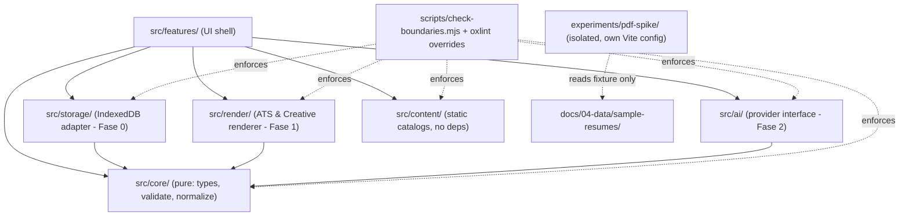
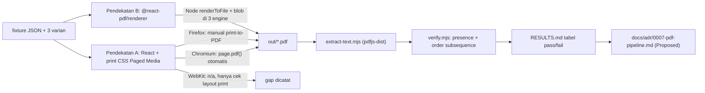

## User Requirements

Menyusun dan menjalankan planning implementasi awal proyek **cv4every1** berdasarkan `prompts/getting-started.md`, mencakup **Task 1 (Bootstrap repository)** dan **Task 2 (Spike S1 — kesetiaan ekspor PDF)** dalam satu plan dua fase dengan checkpoint laporan di antaranya.

Keputusan yang sudah dikonfirmasi pengguna:

- Stack dikunci sesuai usulan docs: Vite + React 19 + TypeScript strict + Tailwind CSS v4 (`@tailwindcss/vite`) + Vitest + Playwright.
- Verifikasi ekstraksi teks PDF memakai **keduanya**: `pdfjs-dist` untuk otomatisasi, `pdftotext` (poppler) untuk verifikasi silang manual yang bersifat opsional.
- Matriks peramban: Chromium + Firefox + Playwright WebKit; WebKit dicatat eksplisit sebagai **proksi, bukan Safari asli**, dan gap dilaporkan terbuka.

## Product Overview

Fase persiapan cv4every1: menyiapkan fondasi proyek yang mencerminkan batas modul arsitektur, lalu membuktikan asumsi paling berisiko (A-T2/A-T3, R1) bahwa ekspor PDF sisi klien menghasilkan teks yang dapat diekstraksi bersih — sebelum satu baris pun kode Fase 0 dibangun di atasnya.

Tidak ada UI produk yang dibuat pada tahap ini: shell aplikasi tetap kosong, dan halaman CV yang dirender di spike adalah eksperimen sekali pakai di luar `src/`.

## Core Features

### Fase A — Bootstrap repository (Task 1)

- Ringkasan pemahaman 5–8 kalimat atas dokumen wajib sebelum menulis kode, untuk dikoreksi pengguna.
- Pengetatan tooling yang sudah ada: TypeScript strict mode, skrip `dev` / `lint` / `format` / `typecheck` / `test` / `build` yang semuanya lulus.
- Struktur modul `src/core/`, `src/storage/`, `src/render/`, `src/ai/`, `src/content/`, `src/features/` sebagai placeholder, masing-masing dengan `README.md` yang mengutip aturan dependensinya.
- Penegakan batas modul secara otomatis (lint + pemeriksa batas), bukan lewat konvensi.
- Rig pengujian: smoke test unit (Vitest) dan smoke test e2e (Playwright) yang lulus.
- CI dasar: lint + typecheck + test + build.
- Tidak memasang Dexie, Zod, Zustand, maupun vite-plugin-pwa (itu milik Fase 0).
- **Checkpoint:** laporkan hasil, tunggu konfirmasi sebelum lanjut ke spike.

### Fase B — Spike S1 kesetiaan PDF (Task 2)

- Direktori eksperimen terisolasi berisi satu halaman CV statis sederhana dari fixture `fresh-graduate-id.json`, ditambah varian untuk edge case: section kosong, teks panjang yang perlu wrap, karakter khas CV Indonesia.
- Dua pendekatan dibandingkan: cetak peramban + CSS Paged Media, dan `@react-pdf/renderer`. Pendekatan raster (html2canvas) tidak dipertimbangkan sama sekali.
- Ekspor PDF per pendekatan, lalu ekstraksi teks otomatis untuk memverifikasi nama, kontak, heading, tanggal, format IPK, dan seluruh bullet pulih **lengkap dan berurutan**.
- Uji lintas mesin peramban (Chromium, Firefox, WebKit), termasuk mencatat secara jujur di mana otomatisasi tidak mungkin dan verifikasi manual diperlukan.
- Hasil direkam sebagai **tabel pass/fail** per pendekatan × mesin × varian fixture.
- Draft ADR-0007 (`docs/adr/0007-pdf-pipeline.md`, status Proposed, Bahasa Indonesia) dengan rekomendasi jelas, konsekuensi negatif yang jujur, dan gap Safari dinyatakan eksplisit.
- **Checkpoint:** laporkan hasil spike walau negatif atau ambigu, lalu berhenti — tidak masuk Fase 0 tanpa konfirmasi.

## Temuan Eksplorasi Penting (mengubah asumsi awal)

Workspace **sudah berisi scaffold aplikasi** yang dibuat setelah pengecekan awal. Verifikasi aktual:

| Berkas | Isi terverifikasi |
| --- | --- |
| `package.json` | name `cv4e1`, type module. deps: `react@^19.2.8`, `react-dom`, `tailwindcss@^4.3.3`, `@tailwindcss/vite`, `shadcn@^4.21.0`, `@base-ui/react`, `@phosphor-icons/react`, `class-variance-authority`, `cn`, `tw-animate-css`, `@fontsource-variable/roboto`, `@fontsource-variable/ibm-plex-sans`. devDeps: `vite@^8.3.0`, `@vitejs/plugin-react@^6.1.1`, `babel-plugin-react-compiler`, `@rolldown/plugin-babel`, `oxlint@^1.81.0`, `typescript@~6.0.2`, `@types/node`. Scripts: `dev`, `build` (`tsc -b && vite build`), `lint` (`oxlint`), `preview` |
| `bun.lock` | Package manager = **Bun** (bukan npm) |
| `vite.config.ts` | plugin `react()`, `tailwindcss()`, `babel({ presets: [reactCompilerPreset()] })`, alias `@` → `./src` |
| `tsconfig.app.json` | target es2023, bundler resolution, `verbatimModuleSyntax`, `noUnusedLocals/Parameters`, `erasableSyntaxOnly` — **`strict` TIDAK ada** |
| `tsconfig.node.json` | hanya `include: ["vite.config.ts"]`, **`strict` TIDAK ada** |
| `.oxlintrc.json` | plugins react/typescript/oxc, 2 rule react |
| `src/` | `main.tsx`, `App.tsx` (hanya `<p>Hello World</p>`), `index.css` (Tailwind v4 + shadcn + fontsource + token oklch), `lib/utils.ts` (`export { cn } from "cn"`), `components/ui/button.tsx`, `assets/` |
| `components.json` | shadcn style `base-lyra`, baseColor zinc, iconLibrary phosphor |
| Toolchain | node v26.4.0, npm 12.0.2; `git rev-parse` → **bukan git repository** (meski `.gitignore` ada) |


**Kesenjangan terhadap Task 1 yang harus ditutup:** TypeScript strict, skrip `typecheck`/`test`/`format`, Prettier, folder batas modul + README, penegakan batas modul, Vitest, Playwright, CI, inisialisasi git.

**Keputusan sadar (deviasi dari teks prompt, wajib dilaporkan di checkpoint 1, bukan diputuskan sendiri secara diam-diam):**

1. **Linter = `oxlint` yang sudah ada, bukan ESLint.** Prompt menulis "ESLint + Prettier"; repo sudah memakai oxlint (satu binary Rust, nol plugin transitif, sejalan dengan `dependency-policy.md` §1/§5). Menukar ke ESLint akan menambah ~8–15 dependensi transitif tanpa manfaat fungsional. Prettier tetap dipasang untuk formatting (oxlint tidak memformat).
2. **Package manager = Bun** (`bun.lock` sudah ada dan lockfile wajib dikomit per `dependency-policy.md` §4). Nama skrip dibuat runner-agnostic sehingga `npm run <script>` tetap bekerja; CI memakai `oven-sh/setup-bun`.
3. **Scaffold tidak dibuat ulang.** Task 1 dikerjakan sebagai *hardening + penambahan*, bukan re-scaffold — sesuai AGENTS.md §5 (jangan refactor/reformat yang tidak perlu).
4. **Penyedia CI = GitHub Actions** (`docs/08-delivery/ci-cd.md` §6 masih TODO). Keputusan tooling ringan, dicatat di doc tersebut, tidak butuh ADR (bukan komponen runtime).

**Requirement ID yang dilayani (terverifikasi di `docs/02-requirements/srs.md`):**

- Task 1: tidak ada FR spesifik (prompt menyebutnya "prasyarat Fase 0"). Ditautkan ke NFR-012 (aset statis), NFR-008 (anggaran performa, diukur sejak awal per A-T4), dan batas modul `architecture-overview.md` §5. Ketiadaan FR khusus dilaporkan eksplisit, tidak dikarang.
- Task 2: **FR-301, FR-302, FR-303, FR-304**, **NFR-003, NFR-010, NFR-015**; batasan **C-T4, C-T5, C-T10, C-T11**, kualitas **C-Q6**; asumsi **A-T2, A-T3**; risiko **R1**; roadmap Fase −1 S1.

## Tech Stack

| Lapisan | Pilihan | Status |
| --- | --- | --- |
| Build | Vite 8 + Rolldown, React Compiler via Babel | sudah ada, dipertahankan |
| UI | React 19 + TypeScript 6 (strict diaktifkan) | sudah ada, diketatkan |
| Styling | Tailwind CSS v4 via `@tailwindcss/vite`, token shadcn/base-ui | sudah ada |
| Font | `@fontsource-variable/*` dibundel (nol CDN → C-T11/NFR-015) | sudah ada |
| Lint | `oxlint` + `overrides` per modul | sudah ada, diperluas |
| Format | **Prettier** (baru, devDependency) | ditambahkan |
| Unit test | **Vitest** + `jsdom` + `@testing-library/react` (baru) | ditambahkan |
| E2E | **`@playwright/test`** (baru) chromium/firefox/webkit | ditambahkan |
| CI | GitHub Actions + `setup-bun` | ditambahkan |
| Spike PDF | `@react-pdf/renderer` (devDep eksperimen), `pdfjs-dist` (devDep verifikasi) | hanya di `experiments/`, bukan dependensi app |
| Dilarang di fase ini | Dexie, Zod, Zustand, vite-plugin-pwa, html2canvas | tidak dipasang |


## Implementation Approach

**Strategi:** dua fase berurutan dengan gerbang manusia di antaranya. Fase A mengubah repo dari "scaffold shadcn generik" menjadi "kerangka cv4every1 yang menegakkan arsitekturnya sendiri". Fase B membuktikan R1 lewat eksperimen terisolasi di luar `src/`, sehingga kalau hasilnya negatif, yang dibuang hanya folder `experiments/` — bukan arsitektur aplikasi.

**Keputusan teknis kunci dan alasannya:**

1. **Penegakan batas modul berlapis dua, bukan lewat konvensi.**
`architecture-overview.md` §5 menyebut batas modul "mengikat", tapi tabel di dokumen tidak menegakkan apa pun. Lapisan penegakan:

- **`.oxlintrc.json` `overrides`** dengan rule `no-restricted-imports` per glob: `src/core/**` melarang `react`, `react-dom`, `@/storage/*`, `@/render/*`, `@/ai/*`, `@/features/*`; `src/render/**` melarang `@/storage/*`, `@/ai/*`; `src/storage/**` melarang `react`, `@/render/*`; `src/ai/**` melarang `@/storage/*`, `@/render/*`; `src/content/**` melarang seluruh `@/*` dan seluruh dependensi.
- **`scripts/module-boundaries.mjs`** — fungsi murni `findBoundaryViolations(files)` (tabel izin sebagai data, satu pass regex atas pernyataan `import`/`export from`/`import()`, termasuk import relatif lintas modul yang lolos dari pola `@/`) + wrapper IO `scripts/check-boundaries.mjs`. Diuji dengan Vitest (kasus positif & negatif). Alasan perlu lapisan kedua: cakupan rule path-based di oxlint masih berkembang dan import relatif (`../render/x`) mudah lolos; pemeriksa 80 baris tanpa dependensi lebih murah daripada memasang plugin boundaries ber-transitif banyak. Kompleksitas O(jumlah berkas), satu pass, dijalankan di CI.

2. **Strict mode diaktifkan sekarang, saat `src/` masih hampir kosong.** Ditambahkan ke `tsconfig.app.json` dan `tsconfig.node.json`: `strict`, `noUncheckedIndexedAccess`, `exactOptionalPropertyTypes`, `noImplicitOverride`. Tiga flag terakhir penting khusus untuk Fase 0 (schema `ResumeDocument` dengan banyak field opsional + `sectionOrder` berbasis indeks); mengaktifkannya nanti akan memaksa refactor lintas berkas. Biaya sekarang ≈ nol karena hanya ada 5 berkas TS.

3. **Spike diisolasi sebagai proyek Vite kedua**, `experiments/pdf-spike/` dengan `vite.config.ts` sendiri dan `tsconfig.spike.json` sendiri, di luar `include` tsconfig app. Konsekuensi yang disengaja: `@react-pdf/renderer` (~1 MB+) **tidak pernah masuk bundle aplikasi** dan tidak mengganggu anggaran performa NFR-008 sebelum ADR-0007 memutuskan apa pun. `build` app tetap `tsc -b && vite build` tanpa perubahan perilaku.

4. **Menangani kenyataan otomatisasi PDF lintas peramban secara jujur.** `page.pdf()` Playwright **hanya tersedia di Chromium**; Firefox dan WebKit tidak dapat menghasilkan PDF secara terprogram. Karena itu matriks dibagi dua sumbu:

- **Pendekatan A (print CSS):** PDF otomatis hanya di Chromium. Firefox → prosedur manual terdokumentasi (print-to-PDF bawaan) dengan checklist langkah dan lokasi artefak. WebKit → **tidak mungkin**; dicatat sebagai sel `n/a (tidak dapat diotomatisasi)`, ditambah gap Safari asli yang tetap terbuka. Untuk tetap mendapat sinyal lintas mesin, Playwright di ketiga engine memverifikasi *layout print* via emulasi media print (`emulateMedia({ media: 'print' })`): jumlah kolom, foto tersembunyi, tinggi konten, tidak ada overflow — yaitu bukti A-T3 yang bisa diperoleh tanpa PDF.
- **Pendekatan B (`@react-pdf/renderer`):** PDF dihasilkan oleh library, jadi deterministik dan independen dari mesin peramban. Diuji dua jalur: Node (`renderToFile`, artefak stabil untuk CI) dan in-browser blob di ketiga engine (bukti library berjalan di Firefox/WebKit).
Pembagian ini mencegah kesimpulan palsu "A gagal di WebKit" padahal yang gagal adalah otomatisasinya.

5. **Verifikasi ekstraksi = invariant, bukan pencocokan string bulat-bulat.** `tools/extract-text.mjs` memakai build legacy `pdfjs-dist` untuk mengambil text item beserta urutannya per halaman, lalu `tools/verify.mjs` menurunkan ekspektasi **dari fixture itu sendiri** (nama, email, telepon, heading sesuai `sectionOrder`, tanggal terformat, `3.52/4.00`, seluruh string `highlights`) dan memeriksa (a) keberadaan, (b) **urutan sebagai subsequence** dari teks terekstraksi, (c) tidak ada bullet yang terpotong/terpisah. Kalau ekspektasi di-hardcode, spike akan lulus untuk alasan yang salah dan tidak bisa dipakai ulang sebagai gerbang C-Q6 di Fase 1. `pdftotext` dipakai sebagai cross-check opsional: kalau binary tidak ada di PATH, skrip melewatinya dengan status `skipped`, bukan gagal (Windows).

6. **Isu font sebagai temuan, bukan masalah yang disembunyikan.** `@fontsource-variable/*` hanya menyediakan woff2 — `@react-pdf/renderer` tidak dapat menyematkannya. Pendekatan B karena itu memakai font bawaan (Helvetica) pada spike, dan hasil ekstraksi karakter berdiakritik (é) di bawah encoding WinAnsi **diukur dan dilaporkan**. Ini menjadi konsekuensi negatif eksplisit di ADR-0007 dan input untuk kandidat ADR "Font bundel versus font sistem". Tidak ada aset font baru yang ditambahkan di spike (menghindari pemeriksaan lisensi yang belum perlu).

7. **Fixture: rujuk yang ada, turunkan yang kurang.** `docs/04-data/sample-resumes/fresh-graduate-id.json` dibaca langsung (tanpa duplikasi) sebagai `base`; tiga varian turunan dibuat di `experiments/pdf-spike/fixtures/` hanya untuk edge case yang belum tercakup. Seluruh data fiktif (AGENTS.md §5 Privacy). Catatan penting: fixture base punya `meta.mode: "ats"` **dengan** `photo.enabled: true` — halaman spike wajib menyembunyikan foto tanpa menyentuh data, sehingga spike sekalian memvalidasi FR-002/FR-003 secara struktural.

8. **Blast radius & kompatibilitas.** `src/App.tsx`, `src/index.css`, `components.json`, `src/components/ui/button.tsx` tidak diubah isinya (kecuali App.tsx diberi markup shell minimal + `data-testid` agar smoke e2e stabil). Tidak ada commit/push otomatis; `git init` hanya kalau `.git` memang belum ada, dan tanpa commit kecuali diminta. Tidak ada penulisan konten resume ke log (NFR-011) — skrip spike hanya mencetak nama berkas dan status pass/fail, bukan isi teks yang diekstraksi (hanya cuplikan pendek berupa token yang gagal).

## Implementation Notes

- **Skrip harus lintas-shell (PowerShell).** Hindari `&&` di dalam nilai skrip npm bila memungkinkan; pakai script Node (`.mjs`) untuk orkestrasi, bukan chaining shell. Path di skrip memakai `node:path` dan `fileURLToPath`, bukan literal `/`.
- **`tsc -b` sudah dipakai di `build`.** Tambahkan `typecheck` sebagai `tsc -b --noEmit`-ekuivalen (proyek sudah `noEmit: true`, jadi `tsc -b` cukup); jangan buat konfigurasi tsc ketiga yang tumpang tindih. Berkas Vitest/Playwright/scripts harus masuk salah satu proyek tsconfig agar `typecheck` benar-benar mencakupnya (tambahkan `tsconfig.test.json` atau perluas `tsconfig.node.json` `include`).
- **Anggaran CI.** Playwright browser besar: job PR hanya install Chromium untuk smoke e2e; tiga engine hanya di job spike/manual dispatch. Cache `~/.bun/install/cache` dan `~/.cache/ms-playwright`.
- **Artefak spike di-gitignore** (`experiments/pdf-spike/out/`), tapi `RESULTS.md` dikomit karena ia bukti keputusan ADR.
- **Vitest environment dipisah**: `environment: 'node'` sebagai default (agar test `core/` benar-benar tanpa DOM, menegakkan §5), dan override `environment: 'jsdom'` hanya untuk pola `*.dom.test.tsx`. Ini membuat pelanggaran "core menyentuh DOM" gagal di test, bukan lolos.
- **Jangan tandai ADR-0007 `Accepted`.** Status `Proposed` sampai pengguna memutuskan; ADR append-only.
- **Bahasa:** semua berkas di `docs/**` (termasuk ADR-0007) Bahasa Indonesia; kode, identifier, nama berkas, dan `src/**/README.md` Bahasa Inggris (AGENTS.md §12) — `RESULTS.md` di `experiments/` ditulis Bahasa Indonesia karena ia laporan yang dibaca manusia dan menjadi sumber ADR.
- **Definition of Done per fase**: `lint`, `format:check`, `typecheck`, `check:boundaries`, `test`, `test:e2e`, `build` semuanya lulus; tidak ada test di-skip; tidak ada secret/PII di diff.

## Architecture Design

Bootstrap hanya membuat **kerangka kosong** dari pipeline yang sudah diputuskan ADR-0004, tanpa mengimplementasikan isinya:



Alur spike:



## Directory Structure

### Ringkasan

Fase A mengetatkan konfigurasi yang sudah ada dan menambahkan kerangka modul + rig uji + CI. Fase B menambahkan direktori eksperimen terisolasi dan draft ADR. Tidak ada berkas produk yang ditulis ulang.

```
cv4e1/
├── package.json                      # [MODIFY] Tambah devDeps: prettier, vitest, jsdom, @testing-library/react,
│                                     #   @testing-library/jest-dom, @playwright/test, (Fase B) @react-pdf/renderer, pdfjs-dist.
│                                     #   Tambah scripts: typecheck, format, format:check, test, test:unit, test:e2e,
│                                     #   check:boundaries, verify (agregat), spike:dev, spike:build, spike:run, spike:verify.
│                                     #   JANGAN tambah dexie/zod/zustand/vite-plugin-pwa. Nama script runner-agnostic.
├── tsconfig.app.json                 # [MODIFY] Aktifkan "strict": true, noUncheckedIndexedAccess,
│                                     #   exactOptionalPropertyTypes, noImplicitOverride. Jangan ubah target/module/jsx.
├── tsconfig.node.json                # [MODIFY] Aktifkan strict; perluas include ke vitest.config.ts,
│                                     #   playwright.config.ts, scripts/**, agar typecheck mencakup tooling.
├── tsconfig.json                     # [MODIFY] Tambah reference ke tsconfig.test.json (dan spike bila perlu).
├── tsconfig.test.json                # [NEW] Proyek tsconfig untuk berkas test (tipe vitest/@playwright, jsdom lib),
│                                     #   include tests/** dan src/**/*.test.ts(x). Strict aktif.
├── .oxlintrc.json                    # [MODIFY] Tambah blok "overrides" berisi no-restricted-imports per modul sesuai
│                                     #   tabel batas modul architecture-overview.md §5; tambah ignorePatterns untuk
│                                     #   experiments/pdf-spike/out. Pertahankan 2 rule react yang sudah ada.
├── .prettierrc.json                  # [NEW] Konfigurasi format minimal (semi: false, singleQuote: false, printWidth 100)
│                                     #   agar konsisten dengan gaya berkas scaffold yang sudah ada.
├── .prettierignore                   # [NEW] Abaikan dist, node_modules, bun.lock, experiments/pdf-spike/out, docs (docs
│                                     #   ditulis manual, jangan direformat massal — AGENTS.md §5).
├── .gitignore                        # [MODIFY] Tambah: test-results/, playwright-report/, coverage/,
│                                     #   experiments/pdf-spike/out/, .vitest/.
├── vite.config.ts                    # [MODIFY - minimal] Tambah "build.outDir" default tetap; tidak ada plugin baru.
│                                     #   Hanya diubah bila diperlukan untuk memisahkan experiments dari root build.
├── vitest.config.ts                  # [NEW] environment default "node" (menegakkan core tanpa DOM), override jsdom
│                                     #   untuk *.dom.test.tsx, alias "@" sama dengan vite.config.ts, include
│                                     #   src/**/*.test.* dan tests/unit/**, exclude experiments/**/out.
├── playwright.config.ts              # [NEW] projects chromium/firefox/webkit, webServer menjalankan vite preview pada
│                                     #   build produksi, testDir tests/e2e, retries 0 lokal, reporter list+html.
├── index.html                        # [MODIFY - opsional] Perbarui <title> menjadi cv4every1 dan lang="id".
├── src/
│   ├── App.tsx                       # [MODIFY - minimal] Shell kosong dengan landmark (<main>) + data-testid="app-shell"
│   │                                 #   agar smoke e2e/komponen punya pegangan stabil. TIDAK ada UI form/CV.
│   ├── main.tsx                      # [KEEP] Tidak diubah.
│   ├── index.css                     # [KEEP] Token shadcn + fontsource sudah sesuai C-T11/NFR-015.
│   ├── lib/utils.ts                  # [KEEP]
│   ├── components/ui/button.tsx      # [KEEP] Milik lapisan features; tidak direfactor.
│   ├── core/
│   │   ├── README.md                 # [NEW] Kutip aturan: boleh bergantung pada — (tidak ada); dilarang React, DOM,
│   │   │                             #   storage, jaringan. Jelaskan alasan (§5) dan bahwa test core jalan di env node.
│   │   └── index.ts                  # [NEW] Placeholder export kosong (mis. export const CORE_MODULE = "core")
│   │                                 #   agar folder valid untuk tsc/lint; tanpa logika bisnis.
│   ├── storage/
│   │   ├── README.md                 # [NEW] Boleh: core/. Dilarang: React, render. Catat bahwa adapter IndexedDB
│   │   │                             #   (Dexie) baru masuk di Fase 0 dan localStorage hanya untuk preferensi UI (C-T7).
│   │   └── index.ts                  # [NEW] Placeholder.
│   ├── render/
│   │   ├── README.md                 # [NEW] Boleh: core/. Dilarang: storage, jaringan, ai/. Catat bahwa aturan mode
│   │   │                             #   ditegakkan di normalize() (ADR-0004), renderer bersifat "bodoh".
│   │   └── index.ts                  # [NEW] Placeholder.
│   ├── ai/
│   │   ├── README.md                 # [NEW] Boleh: core/. Dilarang: storage, render. Catat: AI opsional, wajib fallback
│   │   │                             #   non-AI, tanpa key di repo (ADR-0005/0006, C-T2/C-T3).
│   │   └── index.ts                  # [NEW] Placeholder.
│   ├── content/
│   │   ├── README.md                 # [NEW] Dilarang bergantung pada apa pun. Untuk katalog statis (action verbs,
│   │   │                             #   micro-copy) sebagai data murni.
│   │   └── index.ts                  # [NEW] Placeholder.
│   └── features/
│       ├── README.md                 # [NEW] Boleh bergantung pada semua modul di atas. Tempat komposisi UI; aturan
│       │                             #   bisnis TIDAK boleh ditulis di sini (AGENTS.md §5).
│       └── index.ts                  # [NEW] Placeholder.
├── scripts/
│   ├── module-boundaries.mjs         # [NEW] Fungsi murni: tabel izin modul sebagai data + findBoundaryViolations()
│   │                                 #   yang menerima daftar {file, imports} dan mengembalikan pelanggaran.
│   │                                 #   Tanpa I/O, dapat diuji unit.
│   ├── check-boundaries.mjs          # [NEW] Wrapper I/O: baca src/** (satu pass), ekstrak specifier import
│   │                                 #   (import/export from/import()), panggil fungsi murni, exit code 1 bila
│   │                                 #   ada pelanggaran dengan pesan file:line yang actionable.
│   └── check-pdftotext.mjs           # [NEW] Deteksi ketersediaan binary pdftotext di PATH; mengembalikan status
│                                     #   available/skipped (Windows-safe), dipakai verify.mjs sebagai cross-check opsional.
├── tests/
│   ├── unit/
│   │   ├── smoke.test.ts             # [NEW] Smoke unit test (env node) yang membuktikan rig Vitest berjalan.
│   │   ├── module-boundaries.test.ts # [NEW] Unit test fungsi murni boundary checker: kasus lolos (features → core)
│   │   │                             #   dan kasus gagal (core → react, render → storage, relatif ../storage).
│   │   └── app-shell.dom.test.tsx    # [NEW] Smoke component test (env jsdom) render <App/>, cek landmark main +
│   │                                 #   data-testid ada; sekaligus bukti rig RTL bekerja.
│   └── e2e/
│       └── smoke.spec.ts             # [NEW] Playwright smoke: buka app shell, app-shell terlihat, tanpa console error,
│                                     #   judul halaman benar. Dijalankan di 3 project engine.
├── .github/workflows/
│   ├── ci.yml                        # [NEW] Job "verify": setup-bun, bun install --frozen-lockfile, lint, format:check,
│   │                                 #   typecheck, check:boundaries, test:unit, build. Job "e2e" (PR ke main):
│   │                                 #   install Chromium saja + test:e2e --project=chromium. Cache bun + playwright.
│   │                                 #   Tanpa secret apa pun (C-T2).
│   └── spike-pdf.yml                 # [NEW - Fase B, workflow_dispatch] Jalankan spike Chromium+Firefox+WebKit,
│                                     #   unggah artefak PDF + RESULTS.md sebagai build artifact (bukan dikomit).
├── experiments/
│   └── pdf-spike/
│       ├── README.md                 # [NEW] Tujuan spike (R1, FR-301..304, C-T5), cara menjalankan di PowerShell,
│       │                             #   batasan otomatisasi per engine, prosedur manual Firefox, pernyataan bahwa
│       │                             #   direktori ini sekali pakai dan bukan kode produksi.
│       ├── vite.config.ts            # [NEW] Konfigurasi Vite terpisah untuk spike (multi-page: print, reactpdf),
│       │                             #   root di folder ini agar bundle aplikasi utama tidak tersentuh.
│       ├── tsconfig.spike.json       # [NEW] tsconfig khusus spike (strict), di luar include tsconfig.app.
│       ├── fixtures/
│       │   ├── README.md             # [NEW] Catat bahwa base dirujuk dari docs/04-data/sample-resumes (tanpa duplikasi)
│       │   │                         #   dan seluruh varian berisi data fiktif (AGENTS.md privacy).
│       │   ├── empty-sections.json   # [NEW] Varian tanpa organizations/certifications untuk uji "tidak ada heading kosong".
│       │   ├── long-text.json        # [NEW] Varian bullet sangat panjang untuk uji wrap dan page break.
│       │   └── id-characters.json    # [NEW] Varian karakter Indonesia (é, akronim, tanda kurung, en dash, "+62").
│       ├── shared/
│       │   ├── load-fixture.ts       # [NEW] Loader fixture (base dari docs + varian lokal) dengan tipe minimal lokal;
│       │   │                         #   TIDAK mendefinisikan ResumeDocument kanonik (itu milik Fase 0).
│       │   ├── format.ts             # [NEW] Formatter tanggal & IPK sesuai localization-guide, fungsi murni, dipakai
│       │   │                         #   kedua pendekatan agar ekspektasi verifikasi konsisten.
│       │   └── expectations.ts       # [NEW] Turunkan daftar token & urutan yang diharapkan DARI fixture (nama, kontak,
│       │                             #   heading sesuai sectionOrder, tanggal, IPK, semua highlights).
│       ├── print/
│       │   ├── index.html            # [NEW] Entry pendekatan A.
│       │   ├── main.tsx              # [NEW] Render halaman CV statis dari fixture (query param ?fixture=).
│       │   ├── AtsPage.tsx           # [NEW] Satu kolom, tanpa foto meski photo.enabled true (FR-002/FR-003),
│       │   │                         #   heading standar, tanpa tabel, tanpa ikon pengganti teks.
│       │   └── print.css             # [NEW] @page A4 + Letter, margin, break-inside: avoid per item pengalaman,
│       │                             #   @media print menyembunyikan kontrol UI. Font dari @fontsource yang dibundel.
│       ├── reactpdf/
│       │   ├── index.html            # [NEW] Entry pendekatan B (verifikasi in-browser blob di 3 engine).
│       │   ├── main.tsx              # [NEW] Tombol/otomatis generate blob PDF + expose hasil untuk Playwright.
│       │   ├── AtsDocument.tsx       # [NEW] Dokumen @react-pdf/renderer setara AtsPage (urutan & isi identik).
│       │   └── render-node.mjs       # [NEW] renderToFile di Node untuk artefak deterministik (jalur CI).
│       ├── tools/
│       │   ├── run-print.mjs         # [NEW] Playwright: Chromium page.pdf({preferCSSPageSize}) untuk tiap varian;
│       │   │                         #   Firefox/WebKit -> jalankan pemeriksaan layout print (emulateMedia print:
│       │   │                         #   jumlah kolom, foto tersembunyi, overflow) dan tandai PDF sebagai
│       │   │                         #   manual/n-a secara eksplisit, bukan "fail" palsu.
│       │   ├── run-reactpdf.mjs      # [NEW] Hasilkan PDF via Node + via blob di 3 engine (download artefak).
│       │   ├── extract-text.mjs      # [NEW] pdfjs-dist legacy build: ekstrak text item terurut per halaman;
│       │   │                         #   satu instance dipakai ulang, tanpa mencetak isi CV ke log (NFR-011).
│       │   ├── verify.mjs            # [NEW] Bandingkan hasil ekstraksi dengan expectations.ts: presence + urutan
│       │   │                         #   (subsequence) + bullet tidak terpotong; cross-check pdftotext bila tersedia,
│       │   │                         #   status "skipped" bila tidak. Keluarkan JSON hasil per kombinasi.
│       │   └── report.mjs            # [NEW] Susun RESULTS.md: tabel pass/fail/n-a per pendekatan × engine × varian,
│       │                             #   plus catatan temuan (font, diakritik, paginasi).
│       ├── out/                      # [NEW - gitignored] Artefak PDF, teks terekstraksi, hasil JSON.
│       └── RESULTS.md                # [NEW - dikomit] Laporan spike Bahasa Indonesia: metode, tabel pass/fail,
│                                     #   keterbatasan otomatisasi per engine, temuan font & diakritik, rekomendasi.
├── docs/
│   ├── adr/
│   │   ├── 0007-pdf-pipeline.md      # [NEW] Draft ADR, Status: Proposed, Bahasa Indonesia, format persis seperti
│   │   │                             #   ADR-0004 (Status/Date/Decision owner, Context, Options bernomor, Decision,
│   │   │                             #   Consequences Positif+Negatif, Rejected alternatives). Muat tabel pass/fail,
│   │   │                             #   rekomendasi jelas, gap Safari asli (WebKit = proksi) dinyatakan terbuka,
│   │   │                             #   html2canvas ditolak permanen, status dependensi runtime bila opsi B dipilih
│   │   │                             #   (justifikasi per dependency-policy.md §1).
│   │   └── README.md                 # [MODIFY] Tambah baris 0007 (Proposed) di tabel Daftar; perbarui baris
│   │                                 #   "Pipeline PDF" di tabel Kandidat agar menunjuk ADR-0007.
│   ├── 03-architecture/
│   │   ├── architecture-overview.md  # [MODIFY] §3: tandai stack terkonfirmasi (Vite/React+TS/Tailwind/Vitest+Playwright),
│   │   │                             #   catat package manager Bun dan linter oxlint (bukan ESLint) beserta alasan singkat;
│   │   │                             #   §5: tautkan ke mekanisme penegakan (oxlint overrides + check-boundaries).
│   │   │                             #   Baris PDF tetap TODO sampai ADR-0007 diputuskan.
│   │   └── rendering-architecture.md # [MODIFY - pointer saja] §5: tautkan hasil spike (RESULTS.md) dan ADR-0007 sebagai
│   │                                 #   Proposed. Jangan menuliskan kesimpulan sebagai keputusan final.
│   ├── 00-project-context/
│   │   └── assumptions-and-constraints.md # [MODIFY - pointer saja] §5 R1: tambah tautan ke RESULTS.md + ADR-0007.
│   │                                 #   Status asumsi A-T2/A-T3 hanya diubah setelah pengguna menyetujui ADR.
│   ├── 01-product/roadmap.md         # [MODIFY] Fase −1: tandai S1 selesai dengan tautan bukti (hanya jika lulus/ada
│   │                                 #   keputusan); jangan mencentang gerbang keluar tanpa konfirmasi pengguna.
│   └── 08-delivery/ci-cd.md          # [MODIFY] §6: catat penyedia CI terpilih = GitHub Actions dan gerbang mana yang
│                                     #   sudah aktif hari ini versus masih TODO (bundle budget, visual regression, a11y).
└── AGENTS.md / README.md / CONTRIBUTING.md  # [KEEP] Tidak diubah pada plan ini.
```

## Key Code Structures

Satu kontrak yang perlu presisi karena dipakai oleh lint, CI, dan test sekaligus — tabel izin batas modul sebagai data:

```ts
// scripts/module-boundaries.mjs (bentuk kontrak, tanpa implementasi)
type ModuleName = "core" | "storage" | "render" | "ai" | "content" | "features";

interface ModuleRule {
  /** Modul internal yang boleh diimpor. */
  allowedModules: readonly ModuleName[];
  /** Paket eksternal yang dilarang (mis. "react", "react-dom") sebagai pola awalan. */
  forbiddenPackages: readonly string[];
}

interface BoundaryViolation {
  file: string;
  line: number;
  specifier: string;
  reason: string;
}

declare const MODULE_RULES: Readonly<Record<ModuleName, ModuleRule>>;

declare function findBoundaryViolations(
  files: readonly { path: string; imports: readonly { specifier: string; line: number }[] }[],
): BoundaryViolation[];
```

Dan kontrak hasil verifikasi spike, karena bentuknya menentukan tabel di RESULTS.md dan ADR-0007:

```ts
// experiments/pdf-spike/tools/verify.mjs (bentuk kontrak)
type SpikeApproach = "print-css" | "react-pdf";
type Engine = "chromium" | "firefox" | "webkit" | "node";
type Outcome = "pass" | "fail" | "manual-required" | "not-automatable" | "skipped";

interface VerificationResult {
  approach: SpikeApproach;
  engine: Engine;
  fixture: "base" | "empty-sections" | "long-text" | "id-characters";
  outcome: Outcome;
  pageCount: number;
  missingTokens: string[];   // token yang tidak ditemukan
  outOfOrderTokens: string[]; // token yang urutannya salah
  pdftotextCrossCheck: "match" | "mismatch" | "skipped";
  notes: string;             // mis. keterbatasan engine, masalah diakritik
}
```

## Agent Extensions

### Skill

- **playwright-cli**
- Purpose: Menjalankan verifikasi manual/semi-otomatis lintas mesin peramban pada Fase B — membuka halaman spike di Chromium/Firefox/WebKit, mengevaluasi layout mode print, dan memandu prosedur print-to-PDF yang tidak dapat diotomatisasi oleh `page.pdf()`.
- Expected outcome: Bukti per engine (layout satu kolom, foto tersembunyi, tidak ada overflow) dan artefak PDF Firefox terkumpul di `experiments/pdf-spike/out/`, dengan keterbatasan per engine tercatat sebagai `manual-required` / `not-automatable`, bukan kegagalan palsu.

- **pdf**
- Purpose: Melakukan inspeksi dan ekstraksi teks pada PDF hasil spike sebagai verifikasi silang independen dari skrip `pdfjs-dist`, termasuk memeriksa apakah PDF berisi lapisan teks nyata (bukan raster) dan bagaimana karakter berdiakritik pulih.
- Expected outcome: Konfirmasi kedua atas urutan dan kelengkapan teks (nama, kontak, heading, tanggal, bullet) untuk setiap PDF, menjadi dasar kolom cross-check pada tabel pass/fail dan pernyataan C-T5 di ADR-0007.

### SubAgent

- **code-explorer**
- Purpose: Menelusuri `docs/` secara terarah pada langkah pembacaan wajib (Langkah 0) untuk mengumpulkan batasan HARD, requirement ID, dan format ADR dari banyak berkas sekaligus tanpa membaca seluruh 70 berkas.
- Expected outcome: Ringkasan pemahaman 5–8 kalimat yang menyebut requirement ID dan batasan yang relevan secara akurat, siap dikoreksi pengguna sebelum kode ditulis.